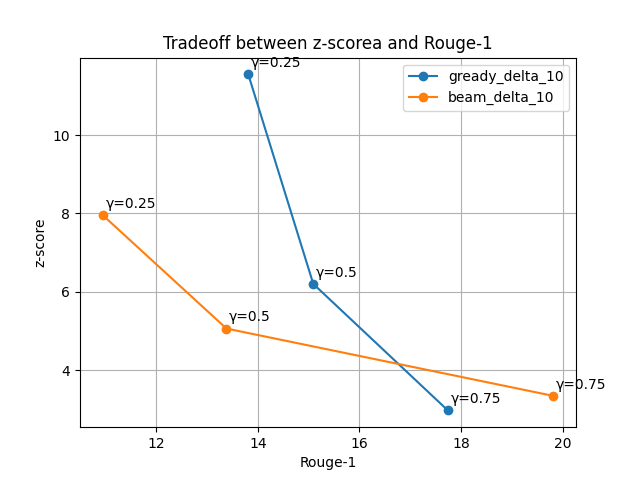

# watermarking 

## Introduction
Large language models (LLMs) have revolutionized natural language processing, enabling them to perform a wide range of tasks, from writing documents to generating executable code and answering complex questions with astonishing human-like proficiency.

Considering these concerns, we focus our efforts in this repository on analyzing the paper [<b>A Watermark for Large Language Models</b>](https://arxiv.org/abs/2301.10226) and studying watermarking effect on the summarization task by using a language model. Through the implementation of this innovative algorithm, our objective is to effectively identify machine-generated text and prevent the potentially harmful effects of language models.

The Watermark algorithm used to generate token st begins by calculating a hash of the preceding token, st-1, and employs this hash as a seed for a random number generator. This seed is then utilized to generate two distinct sets: the "green list" (G) and the "red list" (R). During the generation of token 'st', the model is restricted to employing only those tokens present in the green list. Remarkably, because the red list is chosen at random, a natural writer is expected to violate the red list rule for approximately half of their tokens. In contrast, the watermarked model consistently avoids producing any violations.

## T5 Analysis
In this section, we analyze the impact of watermarking on the T5 summarization model. This model is available at [huggingface](https://huggingface.co/sysresearch101/t5-large-finetuned-xsum-cnn) repository and fine-tuned on [CNN Daily Mail](https://huggingface.co/datasets/cnn_dailymail), and [XSUM](https://huggingface.co/datasets/xsum) datasets.

To analyse watermarking on this model we randomly select the 1000 sample from test set of CNN Daily Mail dataset. 

The Watermark algorithm has two main parameters to create a red and green list, gamma and alpha. Gamma is the ratio of tokens to put in the green list when splitting the vocabulary and delta is the amount of bias (absolute) to add to the logits of the green list tokens at every step.

Table 1 presents the evaluation results of the "watermarks" algorithm when applied to a T5 fine-tuned summarization model. For each combination of "Gamma γ" and "Delta δ", the table reports the algorithm's performance under two distinct generation methods: "Greedy Search" and "Beam Search" decoding.

<table style='text-align:center;'>
  <tr>
    <td rowspan='2'> <b>Gamma γ</b> </td>
    <td rowspan='2'> <b>Delta δ</b> </td>
    <td colspan="2"><b>Rouge-1</b></td>
    <td colspan="2"><b>Rouge-2</b></td>
    <td colspan="2"><b>Rouge-L</b></td>
    <td colspan="2"><b>z-score</b></td>
  </tr>
  <tr>
    <td colspan="1"><b>Greedy</b></td>
    <td colspan="1"><b>Beam</b></td>
    <td colspan="1"><b>Greedy</b></td>
    <td colspan="1"><b>Beam</b></td>
    <td colspan="1"><b>Greedy</b></td>
    <td colspan="1"><b>Beam</b></td>
    <td colspan="1"><b>Greedy</b></td>
    <td colspan="1"><b>Beam</b></td>
  </tr>
  <tr>
  <td rowspan='4'>0.25</td>
    <td colspan="1"> 0(NW) </td>
    <td colspan="1"> 19.63 </td>
    <td colspan="1"> 20.82 </td>
    <td colspan="1"> 4.88 </td>
    <td colspan="1"> 5.42 </td>
    <td colspan="1"> 13.83 </td>
    <td colspan="1"> 14.4 </td>
    <td colspan="1"> - 0.11 </td>
    <td colspan="1"> - 0.32 </td>
  </tr>
  <tr>
    <td>2</td>
    <td colspan="1"> 19.34 </td>
    <td colspan="1"> 20.36 </td>
    <td colspan="1"> 3.92 </td>
    <td colspan="1"> 4.33 </td>
    <td colspan="1"> 13.17 </td>
    <td colspan="1"> 13.61 </td>
    <td colspan="1"> 3.37 </td>
    <td colspan="1"> 4.1 </td>
  </tr>
  <tr>
    <td colspan="1"> 5 </td>
    <td colspan="1"> 16.18 </td>
    <td colspan="1"> 14.62 </td>
    <td colspan="1"> 1.84 </td>
    <td colspan="1"> 1.59 </td>
    <td colspan="1"> 10.8 </td>
    <td colspan="1"> 8.98 </td>
    <td colspan="1"> 8.21 </td>
    <td colspan="1"> 8.51 </td>
  </tr>
  <tr>
    <td colspan="1"> 10 </td>
    <td colspan="1">  13.81 </td>
    <td colspan="1"> 10.94 </td>
    <td colspan="1"> 0.95 </td>
    <td colspan="1"> 0.85 </td>
    <td colspan="1"> 9.17 </td>
    <td colspan="1"> 6.58 </td>
    <td colspan="1"> 11.55 </td>
    <td colspan="1"> 7.96 </td>
  </tr>
<tr>
  <td rowspan='4'>0.5</td>
    <td colspan="1"> 0(NW) </td>
    <td colspan="1"> 19.63 </td>
    <td colspan="1"> 20.82 </td>
    <td colspan="1"> 4.88 </td>
    <td colspan="1"> 5.42 </td>
    <td colspan="1"> 13.83 </td>
    <td colspan="1"> 14.4 </td>
    <td colspan="1"> - 0.30 </td>
    <td colspan="1"> - 0.15 </td>
  </tr>
  <tr>
    <td>2</td>
    <td colspan="1"> 19.12 </td>
    <td colspan="1"> 21.6 </td>
    <td colspan="1"> 3.97 </td>
    <td colspan="1"> 4.59 </td>
    <td colspan="1"> 13.09 </td>
    <td colspan="1"> 13.83 </td>
    <td colspan="1"> 2.47 </td>
    <td colspan="1"> 3.42 </td>
  </tr>
  <tr>
    <td colspan="1"> 5 </td>
    <td colspan="1"> 17.5 </td>
    <td colspan="1"> 17.24 </td>
    <td colspan="1"> 2.61 </td>
    <td colspan="1"> 2.57 </td>
    <td colspan="1"> 11.59 </td>
    <td colspan="1"> 10.83 </td>
    <td colspan="1"> 4.6 </td>
    <td colspan="1"> 5.37 </td>
  </tr>
  <tr>
    <td colspan="1"> 10 </td>
    <td colspan="1"> 15.09 </td>
    <td colspan="1"> 13.38 </td>
    <td colspan="1"> 1.75 </td>
    <td colspan="1"> 1.7 </td>
    <td colspan="1"> 10.26 </td>
    <td colspan="1"> 8.27 </td>
    <td colspan="1"> 6.2 </td>
    <td colspan="1"> 5.06 </td>
  </tr>
  <tr>
  <td rowspan="4"> 0.75 </td>
    <td colspan="1"> 0(NW) </td>
    <td colspan="1"> 19.63 </td>
    <td colspan="1"> 20.82 </td>
    <td colspan="1"> 4.88 </td>
    <td colspan="1"> 5.42 </td>
    <td colspan="1"> 13.83 </td>
    <td colspan="1"> 14.4 </td>
    <td colspan="1"> 0.12 </td>
    <td colspan="1"> 0.11 </td>
  </tr>
  <tr>
    <td>2</td>
    <td colspan="1"> 19.15 </td>
    <td colspan="1">  20.79 </td>
    <td colspan="1"> 4.46 </td>
    <td colspan="1"> 5.15 </td>
    <td colspan="1"> 13.31 </td>
    <td colspan="1"> 14.41 </td>
    <td colspan="1"> 1.8 </td>
    <td colspan="1"> 2.36 </td>
  </tr>
  <tr>
    <td colspan="1"> 5 </td>
    <td colspan="1"> 18.46 </td>
    <td colspan="1"> 20.62 </td>
    <td colspan="1"> 3.69 </td>
    <td colspan="1"> 4.16 </td>
    <td colspan="1"> 12.77 </td>
    <td colspan="1"> 13.51 </td>
    <td colspan="1"> 2.61 </td>
    <td colspan="1"> 3.16 </td>
  </tr>
  <tr>
    <td colspan="1"> 10 </td>
    <td colspan="1"> 17.74 </td>
    <td colspan="1"> 19.82 </td>
    <td colspan="1"> 3.21 </td>
    <td colspan="1"> 3.77 </td>
    <td colspan="1"> 12.25 </td>
    <td colspan="1"> 12.87 </td>
    <td colspan="1"> 2.97 </td>
    <td colspan="1"> 3.34 </td>
  </tr>

</table>

<b style='text-align:center;'>Table 1: Analysis of Machine Learning Classifiers as Baseline
Models</b>

As shown in table 1, the model can achieve a very strong watermark (large z-score) by choosing a small green list size γ and a large green list bias δ. For instance, in our analysis, by selecting γ as 0.25 and δ as 10, we observe z-scores of 11.55 for greedy search and 7.96 for beam search. 

However, it is crucial to note that enhancing the watermark's strength can lead to potential distortion in the generated text.  For instance, within this configuration, the Rouge-1 scores for the greedy search method are 13.87 for γ set to 0.25, while increasing γ to 0.5 under the same δ value of 10,  the Rouge-1 score rises to 15.09. Furthermore, choosing γ to 0.75 results in a Rouge-1 score of 17.74 for the greedy search. In summary, if we aim for a very strong watermark, the performance of the model in the summarization task decreases.

| δ=10                             | δ=5                            | δ=2                            |
| ----------------------------------- | ----------------------------------- | ----------------------------------- |
|  |  | |

